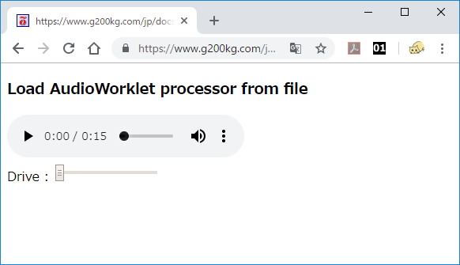

# audioworklet-in-one-file
[ Web Audio API ] Several methods of how to code AudioWorklet within one file

[**GITHUB REPOSITORY**](https://github.com/g200kg/audioworklet-in-one-file/settings)

[**LIVE DEMO**](https://g200kg.github.io/audioworklet-in-one-file/)

## 1. separated files

As usual divide it into main program and file for processor  
[test-worklet0.html](https://g200kg.github.io/audioworklet-in-one-file/test-worklet0.html)

## 2. load from JavaScript string

Embed code for processor in string  
[test-worklet1.html](https://g200kg.github.io/audioworklet-in-one-file/test-worklet1.html)

## 3. load from special-type script

Embed in HTML as a special type of script  
[test-worklet2.html](https://g200kg.github.io/audioworklet-in-one-file/test-worklet2.html)

## 4. load from class-object

Define as normal JavaScript class object and extract from it  
[test-worklet3.html](https://g200kg.github.io/audioworklet-in-one-file/test-worklet3.html)